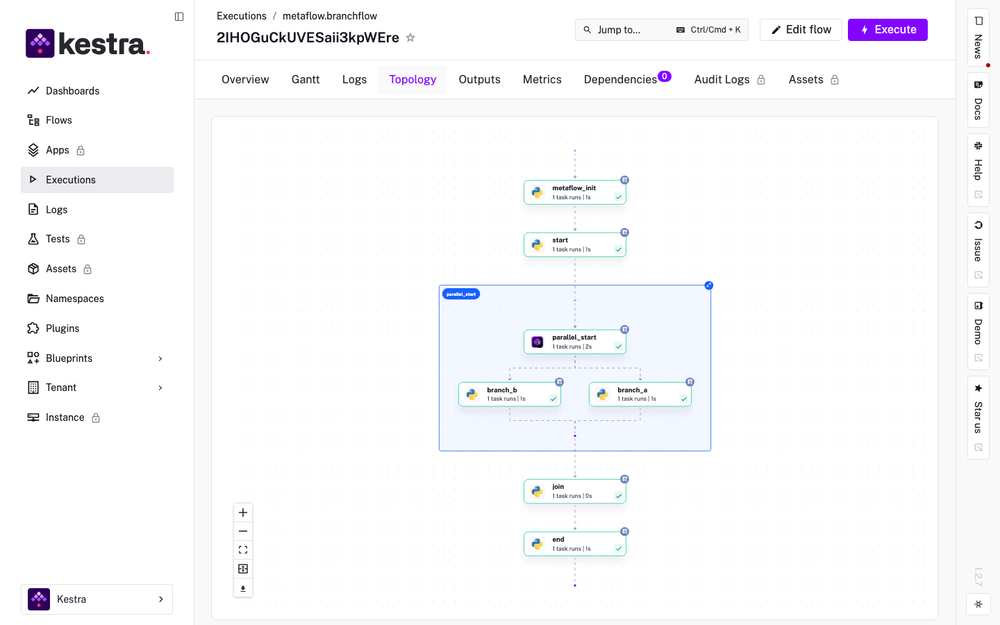
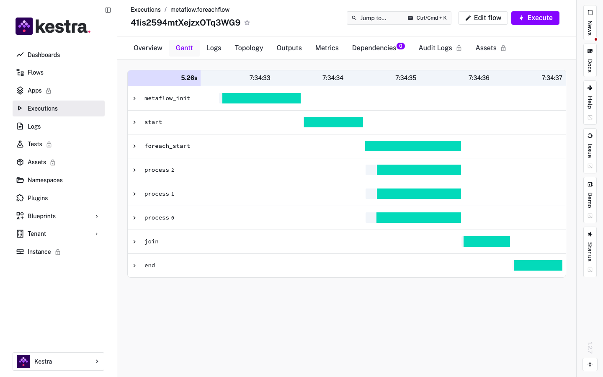
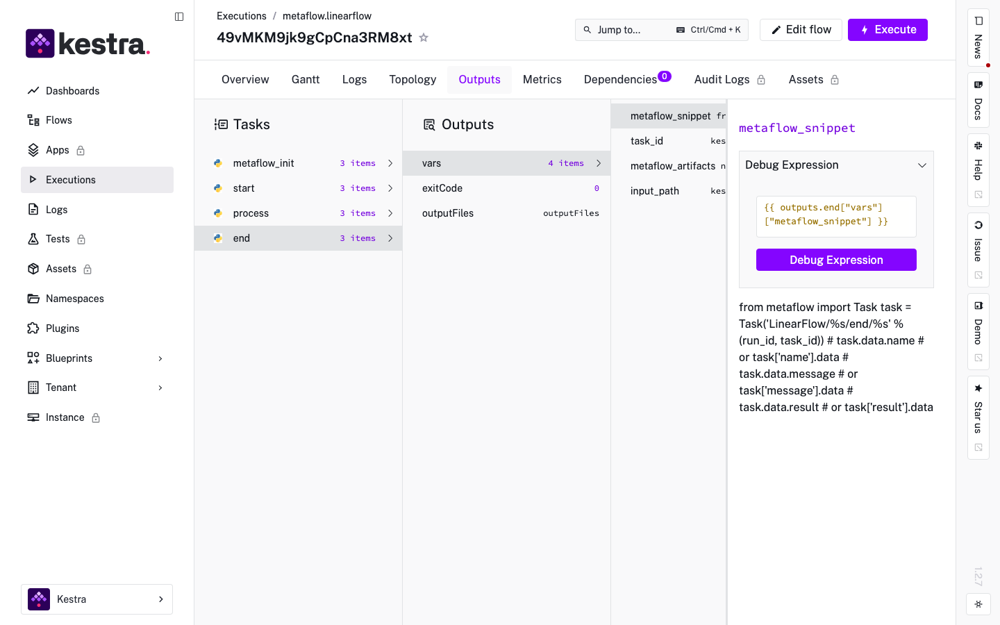
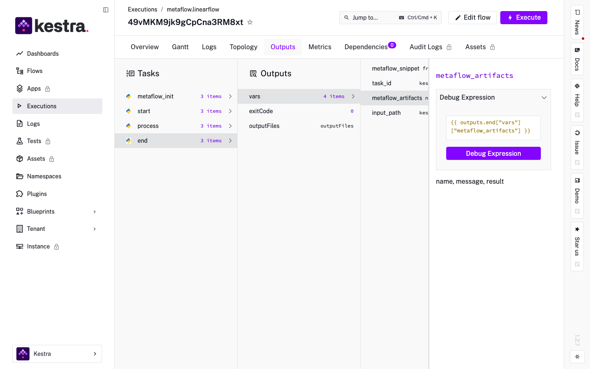

# metaflow-kestra

[](https://github.com/npow/metaflow-kestra/actions/workflows/ci.yml)
[](https://pypi.org/project/metaflow-kestra/)
[](LICENSE)
[](https://www.python.org/downloads/)

Deploy and run Metaflow flows as Kestra workflows.

`metaflow-kestra` compiles any Metaflow flow into a Kestra YAML workflow, letting you schedule,
deploy, and monitor your pipelines through Kestra while keeping all your existing Metaflow code
unchanged.

## Install

```bash
pip install metaflow-kestra
```

Or from source:

```bash
git clone https://github.com/npow/metaflow-kestra.git
cd metaflow-kestra
pip install -e ".[dev]"
```

## Quick start

```bash
python my_flow.py kestra run --kestra-host http://localhost:8080 --wait
```

## Usage

### Generate, deploy, and run

```bash
# Compile the flow to a Kestra YAML
python my_flow.py kestra create flow.yaml

# Deploy to a running Kestra server
python my_flow.py kestra deploy flow.yaml --kestra-host http://localhost:8080

# Compile, deploy, and trigger in one step
python my_flow.py kestra run --kestra-host http://localhost:8080 --wait
```

### All graph shapes are supported

```python
# Linear
class SimpleFlow(FlowSpec):
    @step
    def start(self):
        self.value = 42
        self.next(self.end)
    @step
    def end(self): pass

# Split/join (branch)
class BranchFlow(FlowSpec):
    @step
    def start(self):
        self.data = [1, 2, 3]
        self.next(self.branch_a, self.branch_b)
    ...

# Foreach fan-out (body tasks run concurrently)
class ForeachFlow(FlowSpec):
    @step
    def start(self):
        self.items = [1, 2, 3]
        self.next(self.process, foreach="items")
    ...
```

### Parametrised flows

`metaflow.Parameter` definitions become Kestra input fields automatically:

```python
class ParamFlow(FlowSpec):
    greeting = Parameter("greeting", default="hello")
    count    = Parameter("count", default=3, type=int)
    ...
```

```bash
# Trigger with custom values via the CLI
python param_flow.py kestra run --wait

# Or trigger manually in the Kestra UI — inputs appear as typed form fields
```

### Scheduling

`@schedule` maps to a Kestra cron trigger:

```python
@schedule(cron="0 9 * * 1")   # every Monday at 9 AM
class WeeklyFlow(FlowSpec):
    ...
```

### Step decorator support

`@retry` is read from your flow and applied to the generated Kestra task automatically:

```python
class MyFlow(FlowSpec):
    @retry(times=3, minutes_between_retries=2)
    @step
    def train(self):
        ...
```

## Configuration

### Metadata service and datastore

`metaflow-kestra` bakes the active metadata and datastore backends into the generated YAML at
compile time, so every step subprocess uses the same backend. To use a specific backend:

```bash
python my_flow.py \
  --metadata=service \
  --datastore=s3 \
  kestra create flow.yaml
```

Or via environment variables:

```bash
export METAFLOW_DEFAULT_METADATA=service
export METAFLOW_DEFAULT_DATASTORE=s3
python my_flow.py kestra create flow.yaml
```

### Authentication

```bash
python my_flow.py kestra run \
  --kestra-host http://kestra.internal:8080 \
  --kestra-user admin@example.com \
  --kestra-password secret \
  --wait
```

## How it works

`metaflow-kestra` walks your Metaflow flow's DAG and emits a Kestra YAML. Each Metaflow step
becomes a `io.kestra.plugin.scripts.python.Script` task. The generated YAML:

- runs a `metaflow_init` task first to create the `_parameters` artifact and assign a stable run ID
- runs each step as a subprocess via the standard `metaflow step` CLI
- passes `--input-paths` correctly for joins and foreach splits
- wraps split branches in a `Parallel` task so they execute concurrently
- wraps foreach body tasks in a `ForEach` task
- maps `@retry` to Kestra task retry configuration
- maps `@schedule` to a Kestra cron trigger
- writes Metaflow artifact names and a ready-to-use retrieval snippet to Kestra task outputs after each step

### Kestra UI: execution topology and timeline

The generated flow preserves the Metaflow DAG structure. Branch and foreach fan-outs appear as
nested parallel task groups in the topology view and run concurrently in the Gantt timeline:





### Kestra UI: Metaflow artifact outputs

After each step completes, two extra output variables are posted to the Kestra task:

| Variable | Content |
|---|---|
| `metaflow_artifacts` | Comma-separated list of artifact names produced by the step |
| `metaflow_snippet` | Ready-to-paste Python code to load those artifacts via the Metaflow client |





## Supported constructs

| Construct | Kestra mapping |
|---|---|
| Linear steps | Sequential `Script` tasks |
| `self.next(a, b)` split | `Parallel` task wrapping branch tasks |
| `@step` with `inputs` (join) | Sequential task after `Parallel` completes |
| `self.next(step, foreach=items)` | `ForEach` task |
| `Parameter` | Kestra `inputs` with type mapping (`INT`, `STRING`, `FLOAT`, `BOOLEAN`) |
| `@schedule(cron=...)` | Kestra `Schedule` trigger |
| `@retry` | Kestra task `retry` configuration |

## Development

```bash
git clone https://github.com/npow/metaflow-kestra.git
cd metaflow-kestra
pip install -e ".[dev]"

# Start a local Kestra instance (requires Docker)
docker compose up -d

# Run the integration test suite
KESTRA_HOST=http://localhost:8090 \
python -m pytest tests/test_e2e.py -m integration -v
```

## License

[Apache 2.0](LICENSE)
